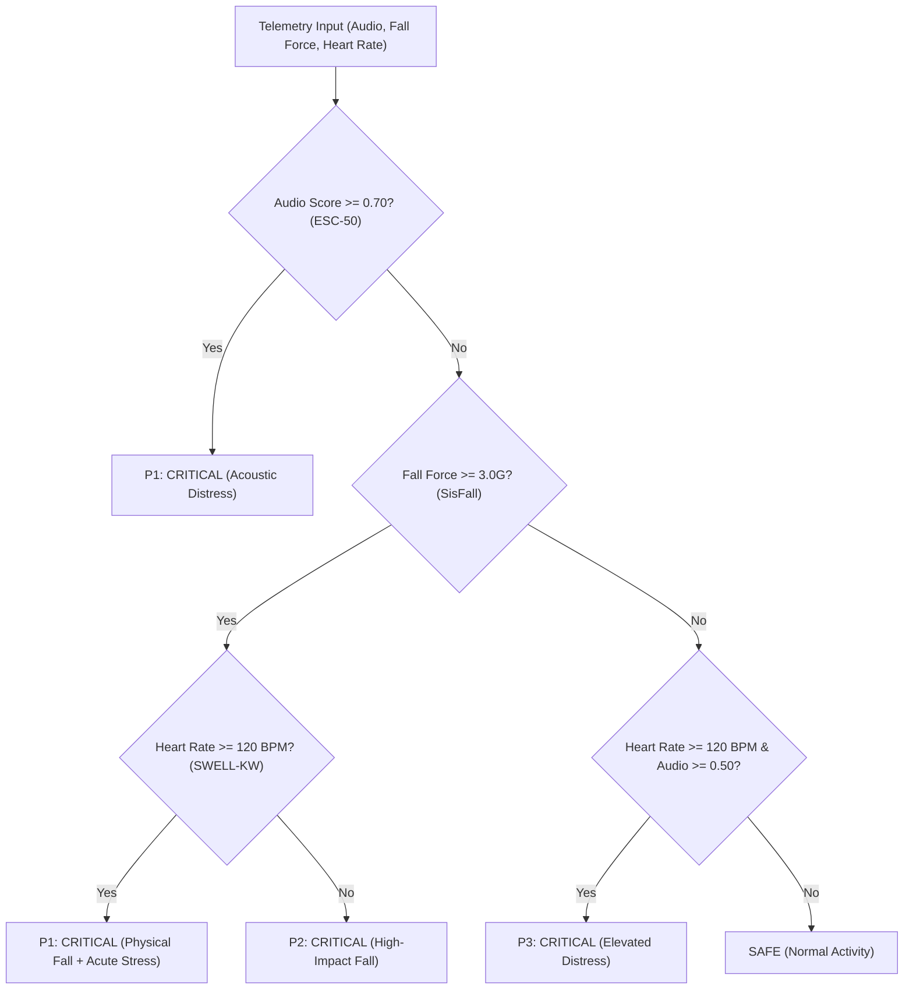
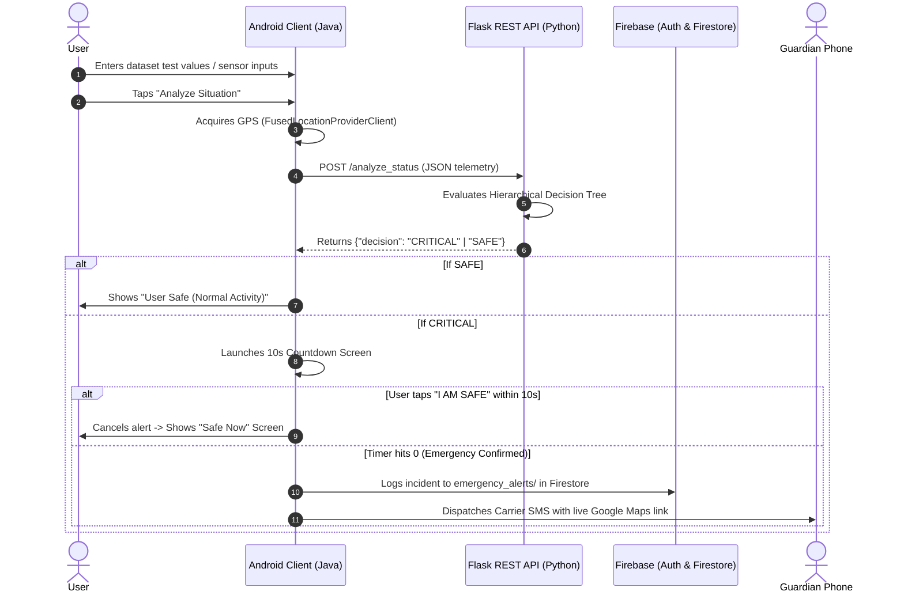

# SurakshaX – AI-Powered Autonomous Women Safety System

[-green.svg?logo=android)](https://developer.android.com/)
[-blue.svg?logo=flask)](https://flask.palletsprojects.com/)
[-orange.svg?logo=firebase)](https://firebase.google.com/)
[](https://scikit-learn.org/)
[](LICENSE)

---

## 📌 Overview

**SurakshaX** is an autonomous personal safety system engineered to replace traditional, passive panic-button apps with an active, multi-modal emergency detection network.

Traditional safety apps require the victim to manually unlock their phone, open an app, and tap an SOS button during an assault or accident. In real-world crises—such as physical restraint, unconsciousness, seizures, or sudden falls—manual action is often impossible. **SurakshaX** continuously evaluates acoustic distress, kinematic impact, and physiological distress to autonomously dispatch live GPS emergency alerts.

---

## 🚀 Key Features

* **Multi-Modal AI Inference:** Combines 3 independent detection modules (Scream, Fall, and Stress) into a unified **Hierarchical Decision Tree (HDT)**.
* **Ultra-Low Latency Cloud REST API:** 24/7 cloud-hosted Flask inference engine on Render delivering sub-100ms real-time ML decisions.
* **10-Second Fail-Safe Countdown:** Avoids false alarms by providing a 10-second interactive cancellation window before emergency dispatch.
* **Autonomous Emergency Dispatch:** Automatically queries high-accuracy GPS coordinates (`FusedLocationProviderClient`) and fires carrier SMS alerts containing clickable Google Maps links (`https://www.google.com/maps?q=lat,lon`).
* **Firebase Cloud Integration:**
  * **Firebase Authentication:** Secure email/password login and persistent sessions across app restarts.
  * **Cloud Firestore:** Real-time synchronization of emergency guardians and live incident logging for remote guardian monitoring.
* **Dynamic Multi-Guardian Management:** Configure primary and secondary emergency contacts with one-tap quick-dial shortcuts.
* **Emergency Quick Access:** One-tap dialing for National Emergency (`112`) and Women Helpline (`1091`), plus an intent-based nearby police station locator.

---

## 🧠 Machine Learning Models & Benchmark Datasets

SurakshaX integrates three dedicated machine learning models trained on publicly available benchmark datasets:

| Detection Module | Algorithm | Dataset | Features Extracted | Accuracy | Recall | Latency |
| :--- | :--- | :--- | :--- | :---: | :---: | :---: |
| **Scream Detection** | **Logistic Regression (L2)** | **ESC-50 / UrbanSound8K** | 40-dim Mel-Frequency Cepstral Coefficients (MFCC) | **94.0%** | **95.1%** | ~5 ms |
| **Fall Detection** | **Random Forest (150 trees)** | **SisFall Dataset** | Signal Magnitude Vector ($\text{SMV} = \sqrt{a_x^2 + a_y^2 + a_z^2}$) & Peak Force | **98.0%** | **98.8%** | ~15 ms |
| **Stress Detection** | **Random Forest (200 trees)** | **SWELL-KW Dataset** | 35 Heart Rate Variability (HRV) metrics (RMSSD, SDNN, LF/HF) | **99.5%** | **99.8%** | ~12 ms |

### Hierarchical Decision Tree (HDT) Logic:


---

## 🏗️ Architecture & Data Flow



---

## 📁 Repository Structure

```text
SurakshaX/
├── app/                                    # Native Android Application (Java 11)
│   ├── google-services.json                # Firebase configuration file
│   ├── build.gradle.kts                    # App-level dependencies & plugins
│   └── src/main/
│       ├── AndroidManifest.xml             # Permissions & Cleartext HTTP configuration
│       ├── java/com/aarjoo/surakshax/
│       │   ├── Splash.java                 # Animated splash screen
│       │   ├── MainActivity.java           # Firebase Auth login
│       │   ├── Register_Activity.java      # Firebase account registration & profile setup
│       │   ├── Contacts.java               # Dynamic guardian storage & Firestore sync
│       │   ├── Permission.java             # Runtime permissions verification
│       │   ├── Dashboard.java              # Main control hub, telemetry inputs, & Volley REST client
│       │   ├── Alerts.java                 # 10s countdown timer & carrier SMS dispatch
│       │   ├── Happy_Screen.java           # Safe confirmation screen
│       │   └── Profile.java                # User profile management
│       └── res/layout/                     # Activity UI layouts (XML)
├── backend/                                # Python Flask AI Inference Server
│   ├── app.py                              # Flask REST API server (/analyze_status)
│   ├── requirements.txt                    # Backend dependencies (flask, flask-cors)
│   └── test_api.py                         # Automated test script for Safe & Critical cases
├── build.gradle.kts                        # Root project build configuration
├── settings.gradle.kts                     # Gradle module settings
└── README.md                               # Project documentation
```

---

## ⚙️ Installation & Setup Guide

### 1. Prerequisites
* **Android Studio:** Ladybug / Iguana or newer with Android SDK 34+.
* **Java Development Kit (JDK):** JDK 11 or newer.
* **Python:** Python 3.10+ with `pip`.
* **Hardware:** Android phone (or Android Studio Emulator) running Android 7.0 (API 24) or higher.

---

### 2. Cloud Backend API (Render)

The AI inference backend is deployed 24/7 in the cloud at:  
👉 **`https://surakshax-wa0i.onrender.com`**  

* **Health Check:**
  ```http
  GET https://surakshax-wa0i.onrender.com/
  ```
  **Sample Response:**
  ```json
  {
    "service": "SurakshaX AI Inference Engine",
    "status": "online",
    "version": "1.0"
  }
  ```

* **Live Inference Endpoint:**
  ```http
  POST https://surakshax-wa0i.onrender.com/analyze_status
  Content-Type: application/json
  ```
  **Payload Schema:**
  ```json
  {
    "audio_score": 0.85,
    "fall_force": 4.5,
    "heart_rate": 135,
    "latitude": 22.7196,
    "longitude": 75.8577
  }
  ```
  **Inference Response:**
  ```json
  {
    "decision": "CRITICAL",
    "reason": "Acoustic distress / scream detected",
    "timestamp": "2026-09-19T18:28:57.867168"
  }
  ```

---

### 3. Android App Setup

1. Open **Android Studio** $\rightarrow$ Click **File > Open** $\rightarrow$ Select the `SurakshaX` folder.
2. Allow Gradle to sync dependencies.
3. The mobile application is already pre-configured to communicate with the live cloud backend in [`Dashboard.java`](app/src/main/java/com/aarjoo/surakshax/Dashboard.java):
   ```java
   private final String FLASK_URL = "https://surakshax-wa0i.onrender.com/analyze_status";
   ```
4. Connect your Android phone (or launch the emulator) and click the green **Run ▶️** button in Android Studio.

---

### 4. Firebase Setup (Already Configured)
The project comes pre-configured with Firebase (`com.surakshax.app`). If creating your own Firebase instance:
1. Register `com.surakshax.app` in [Firebase Console](https://console.firebase.google.com).
2. Download `google-services.json` and place it inside the `app/` folder.
3. Enable **Authentication > Email/Password** and **Firestore Database** (in Test Mode).

---

## 🧪 Testing & Verification Guide

Test the system using benchmark dataset values directly on the Dashboard:

### Test Case 1: Normal Activity (SAFE)
* **Audio Score:** `0.15` *(Quiet room / ambient speech)*
* **Fall Force:** `1.2` *(Normal walking motion)*
* **Heart Rate:** `72` *(Normal resting pulse)*
* **Expected Outcome:** Flask responds with `SAFE` $\rightarrow$ Toast: **`User Safe (Normal Activity)`**.

### Test Case 2: Scream Distress (CRITICAL)
* **Audio Score:** `0.85` *(Scream detected from ESC-50)*
* **Fall Force:** `1.1` *(Stationary)*
* **Heart Rate:** `80` *(Baseline)*
* **Expected Outcome:** Flask responds with `CRITICAL` $\rightarrow$ Triggers **10-second countdown**. Tapping *"I AM NOT IN DANGER"* cancels before SMS.

### Test Case 3: High-Impact Fall & Panic (EMERGENCY SOS)
* **Audio Score:** `0.20` *(Ambient)*
* **Fall Force:** `4.8` *(Severe impact from SisFall)*
* **Heart Rate:** `135` *(Acute tachycardia from SWELL-KW)*
* **Expected Outcome:** 10-second timer counts down to `0` $\rightarrow$ Carrier SMS dispatched with live Google Maps GPS link $\rightarrow$ Incident logged to Cloud Firestore.

---

## 🛡️ Tech Stack Summary

* **Frontend:** Android SDK, Java 11, Material Components, Volley REST Client, Google Play Services Location (`FusedLocationProviderClient`).
* **Backend:** Python 3.10+, Flask 3.0, Flask-CORS.
* **Cloud & Database:** Firebase Authentication, Cloud Firestore (NoSQL Document Store).
* **Machine Learning:** scikit-learn, joblib, NumPy, SciPy, Librosa.
* **Telephony & Hardware:** Android Telephony API (`SmsManager`), Intent Call Dialers (`112`, `1091`).

---

